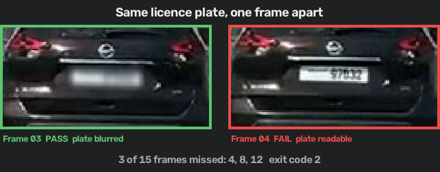

# Visual Verifier

### Anonymization QA for images and videos

**Test blur, redaction, masking, and other visual processing frame by
frame.** Deterministic PASS/FAIL, temporal evidence, and CI-ready reports.

*Anonymizers modify. Visual Verifier verifies.*

🔒 **Runs entirely on your machine. Your media is never uploaded** — the
package has no network dependency at all, and a test enforces that on
every commit.

<p align="center">
  
</p>

```bash
pip install visual-verifier
visual-verifier demo
```

```text
FAIL
Frames missed: 4, 8, 12
```

Or drop it straight into GitHub Actions —
[on the Marketplace](https://github.com/marketplace/actions/visual-verifier):

```yaml
uses: SAMtheROCKET/visual-verifier@v0.3.0
```

---

## Why

Your processing job can succeed while its visual output is wrong.

An anonymizer can exit zero while missing one frame. A masking pipeline
can modify the frame while missing the required face or licence plate. A
watermark job can finish while the mark disappears partway through.

Visual Verifier tests the produced media itself. It is not an anonymizer;
it is the independent test that runs after one.

```text
any anonymizer, redactor, or image/video processor
                      ↓
              VISUAL VERIFIER
                      ↓
        Did the transformation happen?
        Did it happen in every frame?
        Did it cover the required target?
                      ↓
           PASS / FAIL + evidence
```

**Your code has tests. Why shouldn't your processed media?**

## What it catches

| | |
| --- | --- |
| Blur, pixelation, redaction, masking | A frame left unprotected |
| Watermarks and overlays | The mark is missing or too faint |
| Encoding and filter chains | A stage silently did nothing |
| Reviewed targets | A required face or plate was missed |

## What makes it different

- **Frame by frame**, not an averaged whole-file metric
- **Target-aware** — declare the regions that *had* to be anonymized
- **Temporal** — tracks regions through time, with continuity evidence
- **Local and offline** — no upload, no network dependency
- **CI-ready** — `0` passed, `1` could not complete, `2` failed

## Measured

78 generated sequences, 13 labelled failure modes:

| Method | Recall | False alarms |
| --- | ---: | ---: |
| **Visual Verifier + targets** | **100%** | **0.0%** |
| Visual Verifier | 79% | 0.0% |
| Mean pixel difference | 42% | 0.0% |
| PSNR threshold | 42% | 0.0% |
| SSIM threshold | 42% | 0.0% |

Global metrics drop to 0% recall on compressed, noisy, and offset-blur
footage. The benchmark also publishes the cases Visual Verifier itself
fails, and the protocol gives the baselines a held-out calibration set
and an oracle upper bound.

## Honest scope

A `PASS` means accepted visual change was detected under the configured
thresholds — or, with targets, that every declared region was covered.
Coverage is geometric: it does not prove a plate became unreadable to a
human, and it is not a certificate of anonymization.

---

[Documentation](https://samtherocket.github.io/visual-verifier/) ·
[GitHub](https://github.com/SAMtheROCKET/visual-verifier) ·
[Benchmark](https://samtherocket.github.io/visual-verifier/benchmarks/) ·
[Changelog](https://github.com/SAMtheROCKET/visual-verifier/blob/main/CHANGELOG.md)

Apache-2.0
