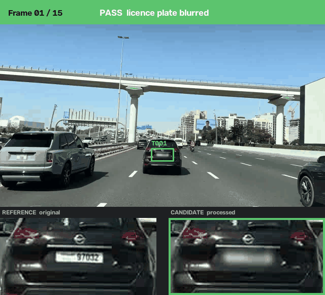

# Visual Verifier

## Anonymization QA for images and videos

**Your anonymizer says the video passed. Frame 4 still exposes the licence
plate.**

Visual Verifier tests blur, redaction, masking, and other visual processing
frame by frame, and returns a deterministic PASS/FAIL, temporal evidence,
and CI-ready reports.

<p align="center">
  
</p>

```bash
pip install visual-verifier
visual-verifier demo
```

```text
FAIL
Frames missed: 4, 8, 12
```

No clone, no fixtures to download, no media of your own required. The
sample is generated on your machine.

!!! info "Runs entirely on your machine"

    Your media is never uploaded. The package imports no networking
    library at all, and
    [a test enforces that](https://github.com/SAMtheROCKET/visual-verifier/blob/main/tests/test_local_execution.py)
    on every commit. This documentation site loads no third-party fonts or
    trackers either.

<p align="center">
  
</p>

## Anonymization is the named use case, not the limit

The engine is a general **pixel-level change verifier**. It measures what
actually changed between a reference and a candidate, region by region and
frame by frame, so anything that alters pixels can be verified the same
way.

| Use it for | What a `FAIL` means |
| --- | --- |
| Blur, pixelation, redaction, masking | A frame was left unprotected |
| Watermark and overlay application | The mark is missing or too faint |
| Encoding, transcoding, filter chains | A stage silently did nothing |
| Compositing, inpainting, style transfer | The edit did not land everywhere |
| Any processed-media regression test | Output drifted from the reference |

Privacy work is where the failure is most expensive, so it is what the
documentation leads with. The verification contract itself makes no
assumption about *why* the pixels changed.

## Start here

| Document | Read it when you want to |
| --- | --- |
| [Getting started](getting_started.md) | Install it and see a real failure in 60 seconds |
| [Anonymization QA](anonymization_qa.md) | Understand exactly what a `PASS` does and does not prove |
| [Use it in CI](ci.md) | Fail a build on an anonymization gap |
| [Limitations](limitations.md) | Know the failure modes before trusting a `PASS` |

## Reference

| Document | Contents |
| --- | --- |
| [Command line](cli.md) | Every command, option, and exit code |
| [Python API](python_api.md) | Functions, result models, and error codes |
| [Output schema](output_schema.md) | Field-by-field meaning of every report |
| [Temporal tracking](temporal_tracking.md) | Association, lifecycle, lineage, and metrics |
| [Verification contract](verification_contract.md) | The formal inputs and outputs |
| [Target annotation](target_annotation.md) | Reviewed target schema and coverage behaviour |
| [Benchmark](benchmarks.md) | Measured comparison against global-metric baselines |
| [GitHub Action](github_action.md) | Every action input, output, and permission |

## Scope and roadmap

| Document | Contents |
| --- | --- |
| [Problem statement](problem_statement.md) | Why this exists and what it excludes by design |
| [Use cases](use_cases.md) | Supported uses and unsupportable claims |
| [Policy system](policy_system.md) | The planned V5.4 selectable policy protocol |

## Working on the code

| Document | Contents |
| --- | --- |
| [Architecture](architecture.md) | Module boundaries and dependency direction |
| [Code style](CODE_STYLE.md) | Naming, typing, docstring, and length rules |
| [Release checklist](release_checklist.md) | Everything a release must satisfy |
| [Development history](development_history.md) | How the prototype became this package |

Project files live in the repository:
[AGENTS.md](https://github.com/SAMtheROCKET/visual-verifier/blob/main/AGENTS.md),
[CONTRIBUTING.md](https://github.com/SAMtheROCKET/visual-verifier/blob/main/CONTRIBUTING.md),
[CHANGELOG.md](https://github.com/SAMtheROCKET/visual-verifier/blob/main/CHANGELOG.md),
[ROADMAP.md](https://github.com/SAMtheROCKET/visual-verifier/blob/main/ROADMAP.md),
[SECURITY.md](https://github.com/SAMtheROCKET/visual-verifier/blob/main/SECURITY.md),
and
[CODE_OF_CONDUCT.md](https://github.com/SAMtheROCKET/visual-verifier/blob/main/CODE_OF_CONDUCT.md).
